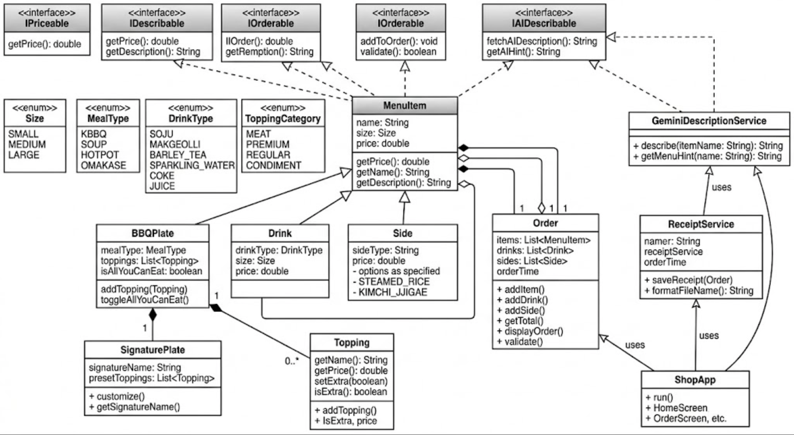

# 999BBQ 🔥
### High-End Korean BBQ Point of Sale System

## Description
999BBQ is a command-line point of sale application for a 
high-end Korean BBQ restaurant. Customers can customize 
their order by choosing meal types, sizes, premium meats, 
toppings, drinks and sides. The application saves receipts 
to a local file system.

## How to Run
1. Clone the repository
2. Open in IntelliJ IDEA
3. Run src/main/java/com/kbbq999/Main.java

## Features
- Full menu display on launch
- 4 meal types: KBBQ, Soup, Hotpot, Omakase
- 3 sizes: Small ($45), Medium ($75), Large ($120)
- Premium meats: Australian Wagyu, Brisket, Galbi, Pork Belly, Bulgogi, Spicy Bulgogi
- Premium toppings: Salmon Roe, Corn Cheese, Snow Crab, Steamed Egg
- Regular toppings and condiments included free
- Drinks and sides
- All-You-Can-Eat upgrade (+$35)
- Automatic receipt generation saved to receipts/

## Tech Stack
- Java 26
- Maven
- OOP: Interfaces, Abstract Classes, Enums, Inheritance, Streams

## Interesting Code
Order total calculated using Java Streams:
```java
public double getTotal() {
    return items.stream().mapToDouble(MenuItem::getPrice).sum()
         + drinks.stream().mapToDouble(Drink::getPrice).sum()
         + sides.stream().mapToDouble(Side::getPrice).sum();
}
```

## Class Diagram


## Screens
- Home Screen - displays full menu and order options
- Order Screen - manage items in current order
- Add Item Screen - customize your BBQ plate
- Add Drink Screen - select drink and size
- Add Side Screen - select side dish
- Checkout Screen - review order and confirm

## Future Enhancements
- Gemini AI integration for menu item descriptions
- Signature preset plates
- Online ordering support
